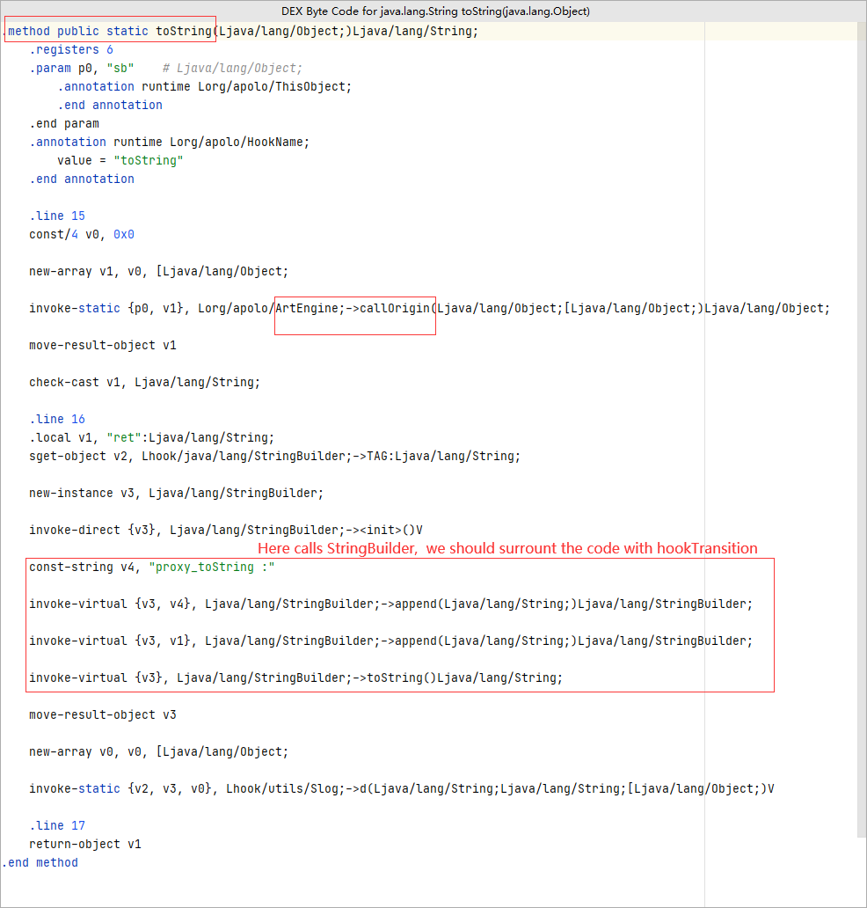

# ApoloPlugin


**ApoloPlugin** 提供了一个Android轻量级的java hook 库，它支持 arm32 和 arm64两种架构。Apolo意为阿波罗，其为艺术之神，Art翻译过来也有艺术之意，故以此命名。

## 最新版本号

    ApoloPlugin: 0.0.4
    xposed: 0.0.4

## 相关文档

[Apolo插件实战-ROM环境注入app分析其行为](docs/Apolo%E6%8F%92%E4%BB%B6%E5%AE%9E%E6%88%98-ROM%E7%8E%AF%E5%A2%83%E6%B3%A8%E5%85%A5app%E5%88%86%E6%9E%90%E5%85%B6%E8%A1%8C%E4%B8%BA.md)

[Apolo插件实战-dex反优化后trace代码](docs/Apolo%E6%8F%92%E4%BB%B6%E5%AE%9E%E6%88%98-dex%E5%8F%8D%E4%BC%98%E5%8C%96%E5%90%8Etrace%E4%BB%A3%E7%A0%81.md)

## 背景

ArtHook的灵感，都要从接触[jvmti](https://source.android.com/devices/tech/dalvik/art-ti?hl=zh-cn)技术开始。但是framework只支持debug包加载jvmti插件，虽然某些技术分享者过掉了debug检测，但是运行时依然功能受限。后续又通过研究android.os.Trace，发现了art另一机制-instrumentation。该机制功能非常强大，比如下述源码(均在art/runtime/instrumentation.cc中)
```c++
void Instrumentation::InstallStubsForClass(ObjPtr<mirror::Class> klass) {
    ...
}
void Instrumentation::InstallStubsForMethod(ArtMethod* method) {
    ...
}

Instrumentation::InstrumentationLevel Instrumentation::GetCurrentInstrumentationLevel() const {
  if (interpreter_stubs_installed_) {
    return InstrumentationLevel::kInstrumentWithInterpreter;
  } else if (entry_exit_stubs_installed_) {
    return InstrumentationLevel::kInstrumentWithInstrumentationStubs;
  } else {
    return InstrumentationLevel::kInstrumentNothing;
  }
}


```
特别是GetCurrentInstrumentationLevel函数中kInstrumentWithInterpreter以及kInstrumentWithInstrumentationStubs这两个变量大大引发了我的思考，并由此开始了Apolo插件之路。

经过一个月左右的研究，此路已通。虽然还有一些问题待解决，但是经过版本迭代，我相信Apolo插件会更加完善。我个人其实也没有什么终极目标，毕竟技术一直都在变化，只愿能真正帮助到有需求的人。

## 特性

*  支持Android8.1 - Android12
*  支持armeabi-v7a以及arm64-v8a
*  支持静态函数、实例函数、构造方法
*  提供便利的接口调用原方法
*  无需将ArtMethod解释执行，性能损耗较小
*  兼容JIT/AOT模式
*  支持xposed api

**注意**: 暂时不支持声明为abstract、interface、native等特殊函数hook

## 即将支持
* **jni函数的hook**功能**研发中...
* **java trace功能**研发中...(逆向分析神器，无需脱壳)
* **Apolo辅助模块**讨论设计中...
* **原理架构文档**待完善


## 缺陷

* 不支持java.lang.String构造函数以及其他暂未发现的函数
* release包的情况下，某些函数可能hook不到(debug包没有该问题，后续会完善解决)

## 如何接入

### 在您module下的build.gradle中增加依赖项

ApoloPlugin目前发布在[maven central](https://search.maven.org/), 方便接入
```Gradle
dependencies {
    implementation "io.github.waxmoon:ApoloPlugin:0.0.4"
}
```

### 如果您要使用xposed api，也可以增加xposed依赖
```Gradle
dependencies {
    implementation "io.github.waxmoon:xposed:0.0.4"
}
```

## 了解接口函数并上手

接口函数可以在仓库[ApoloPlugin module](ApoloPlugin)找到，目前只提供了Java版本

示例代码可以在[app module](app)中找到

### 1.加载核心so库，初始化hook引擎

```Java
public class DemoApplication extends Application {
    private static Application sApp;
    static {
        //init ArtHook
        ArtEngine.preLoad();
    }

    @Override
    public void onCreate() {
        super.onCreate();
    }
}
```
hook引擎中会绕过hiddenApi检测，该处参考了[RePublic](https://github.com/whulzz1993/RePublic)。所以调用preLoad之后，您无须担心hiddenApi问题。

### 2.使用HookClass/HookName注解声明您要hook的java method

比如hook Java.lang.String.equals函数([样例](https://github.com/WaxMoon/ApoloPlugin/blob/main/app/src/main/java/hook/java/lang/StringProxy.java))


```Java
@HookClass(String.class)
public class StringProxy {

    private static final String TAG = StringProxy.class.getSimpleName();
    @HookName("equals")
    public static boolean equals(@ThisObject String str1, Object str2) {
        Slog.d(TAG, "proxy_equals called %s vs %s", str1, str2);
        return ArtEngine.callOrigin(str1, str2);
    }
}
```

**上述代码样例有四个重点**：

*  针对代理类StringProxy, 使用HookClass或者HookName注解，指明原函数所属class
*  针对代理函数,使用HookName注解, 指明原函数的函数信息
*  原函数若为对象函数，第一个参数必须使用ThisObject注解
*  使用ArtEngine.callOrigin接口调用原函数

#### QA:
1) 参数类型不是public class，如何声明代理函数？

       代理函数的参数也可使用HookName注解，比如android.app.ContextImpl.createAppContext(ActivityThread mainThread, LoadedApk packageInfo), 您的代理函数参数可以这样使用:
            (HookName("android.app.ActivityThread" Object mainThread, @HookName("android.app.LoadedApk") Object packageInfo))


2)  代理函数中能否调用其他被代理的函数，这样是否会导致死循环?

        代理函数中支持调用其他被代理的函数，但是一旦调用链形成A->ProxyA->B->ProxyB->A这样一个环形结构，就会出现死循环。您可以在调用其他函数时，尝试使用ArtEngine.hookTransition规避此类问题。app样例中就有该类问题，比如hook了StringBuilder.toString函数，并且在代理函数中使用Log.d，有可能就会因为再次间接调用StringBuilder.toString, 导致死循环.

下图为StringBuilder.toString代理函数的smali code，我们可以看到字符串拼接被编译成了StringBuilder.append，最后会调用StringBuilder.toString。


为了防止死循环，我在[Slog.d代码前后添加了hookTransition解决](https://github.com/WaxMoon/ApoloPlugin/blob/main/app/src/main/java/hook/java/lang/StringBuilder.java)
```Java
    @HookName("toString")
    public static String toString(@ThisObject Object sb) {
        String ret = ArtEngine.callOrigin(sb);
        ArtEngine.hookTransition(true);
        Slog.d(TAG, "proxy_toString :" + ret);
        ArtEngine.hookTransition(false);
        return ret;
    }
```


**再次注意**: 1)原函数如果是static，那么代理函数的参数类型与原函数需保持一致。2)原函数非static，那么代理函数的第一个参数类型必须使用ThisObject注解，其余参数与原函数保持一致

### 3.使用addHookers/addHooker接口将注解类添加至引擎中

代码示例[github查看](https://github.com/WaxMoon/ApoloPlugin/blob/main/app/src/main/java/com/example/apolo/DemoApplication.java)

```Java
    private void initHook() {
        ArtEngine.addHookers(getClassLoader(),
                StringProxy.class,
                StringBuilder.class,
                HandlerProxy.class,
                ActivityThread.class,
                ApplicationPackageManager.class,
                ContextImpl.class,
                Settings.Global.class,
                Test.class);

        ArtEngine.addHooker(HttpsURLConnection.class);

        //start hook
        ArtEngine.startHook();
    }
```

### 4.您也可以使用xposed api进行hook

比如您要hook Activity.onCreate(Bundle.class)函数


```Java
        XposedHelpers.findAndHookMethod(Activity.class, "onCreate", Bundle.class, new XC_MethodHook() {
            @Override
            protected void beforeHookedMethod(MethodHookParam param) throws Throwable {
                super.beforeHookedMethod(param);
                Log.e("XposedCompat", "beforeHookedMethod: " + param.method.getName());
            }

            @Override
            protected void afterHookedMethod(MethodHookParam param) throws Throwable {
                super.afterHookedMethod(param);
                Log.e("XposedCompat", "afterHookedMethod: " + param.method.getName());
            }
        });
```

### 5.一切就绪，开始hook

假定您已经通过2中的注解方式或者3中的xposed方式添加了hooker, hook其实还未生效，您需要主动调用ArtHook.startHook才可以

### 6.调用原函数

当前提供了非常方便的接口(ArtEngine.callOrigin(Object instance, Object... args)),上述2中也提及到了。您需要再深刻理解一下该接口，比如静态函数时，第一个参数instance为null即可，但是参数args要求就比较严苛了，不能为null，并且要与原函数签名一致

该处代码，是demo中ActivityThread某静态函数的[hook示例](https://github.com/WaxMoon/ApoloPlugin/blob/main/app/src/main/java/hook/android/app/ActivityThread.java)，callOrigin的时候第一个参数必须显式传null

```Java
@HookName("android.app.ActivityThread")
public class ActivityThread {

    private static final String TAG = ActivityThread.class.getSimpleName();

    @HookName("currentActivityThread")
    public static Object currentActivityThread() {
        Slog.d(TAG, "proxy_currentActivityThread called", new Exception());
        return ArtEngine.callOrigin(null);
    }
}
```

### 7.其他特性

#### 7.1 支持线程级别的hook状态切换

**某些场景下您可能会使用该特性**

* 在代理函数中，直接或者间接调用了某些函数。而这些函数您不确定是否被其他业务逻辑所hook，而您不希望导致不明确的问题，比如死循环等，那么您就可以调用ArtEngine.hookTransition接口

```Java
            try {
                ArtHook.hookTransition(true);
                Log.d(TAG, "TextView_ctor<init> called before+++++++");
                TextView tv = new TextView(DemoApplication.getMyApplication());
                Log.d(TAG, "TextView_ctor<init> called end--------" + tv);
            } finally {
                ArtHook.hookTransition(false);
            }
```

示例函数分为三个步骤，第二步为调用原函数。第一步以及第三步均调用了ArtHook.hookTransition。

所以，您可以简单的将hookTransition理解为hook状态切换, 该函数非常实用:
1) true：状态切换为origin，该线程取消hook. 
2) false: 状态切换为hook，该线程将进行相关函数代理.

**注意**: 如果您在第二步中，有大量逻辑代码，如果该处逻辑中有直接或者间接调用某一个被hook的函数，那么它将不会被代理，直到您调用hookTransition(false)为止。所以此处使用了finally语句块，确保hook继续生效，否则当前线程hook功能会失效(仅当前线程)。


## 愿景

### 1.广大需求爱好者可以尽情提出想法，热烈欢迎
### 2.愿大家多提issue
### 3.欢迎提交代码
### 4.丰富完善Apolo插件，不仅仅只有artHook

## 致谢
*  注解参考/使用了其他框架的现有方式，比如[sandhook](https://github.com/asLody/SandHook)

## 个人简介
### @WaxMoon android framework/hook爱好者，2015年入坑
### 个人QQ3403281183

群消息会及时同步最新feature。
### ApoloPlugin微信群


### ApoloPlugin QQ群

